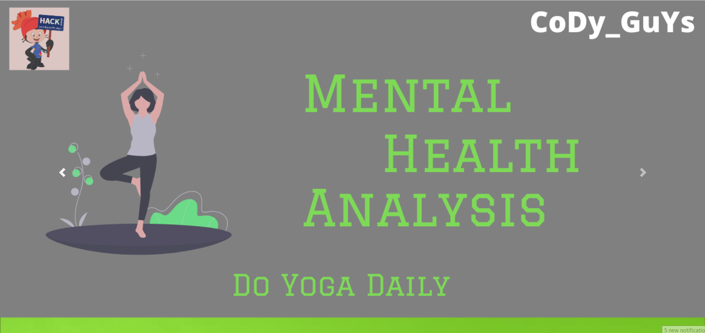
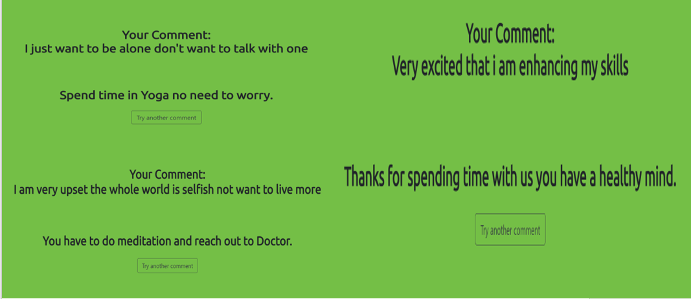

# Thought Analysis

Sentiment analysis is the interpretation and classification of emotions(positive,negative and neutral) within text data using text analysis techniques and accordingly gives you the feedback.

# Mental Health Analysis

During this time of pandemic many families are going through the financial crisis this is directly impacting their mental health thus this projects is to help and advice these people to spend theirtime doing yoga, meditation and concern to doctors in serious situation. As nothing is more importatnt than thier life. Project consits of a web app in which the user will post their thoughts and then
thoughts are processed using NLP and it's nltk library through which thoughts are divided into 3 category such as positive, negative and neutral based on this feedback are given related to their mental status what they have to do. This web is made using HTML,CSS and Flask is used to integrate ML model in the web. Website is also hosted on Heroku so that to test the website one can directly use the heroku link.

# To Run project:

  Steps to run project- 
  1.Open Terminal 
  2.Make the project directory as current directory 
  3.Run api.py file 
  4.Copy the localhost address from output and paste it in chrome to see the website. 

  cd <path/to/your/project> 
  $python api.py 

# Website Frontpage

# Prediction

# Heroku Link : 
  https://mental-health-analysis.herokuapp.com/ 
